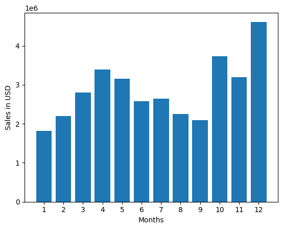
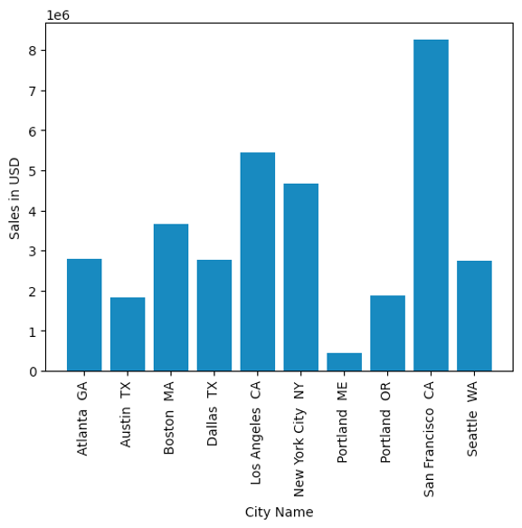
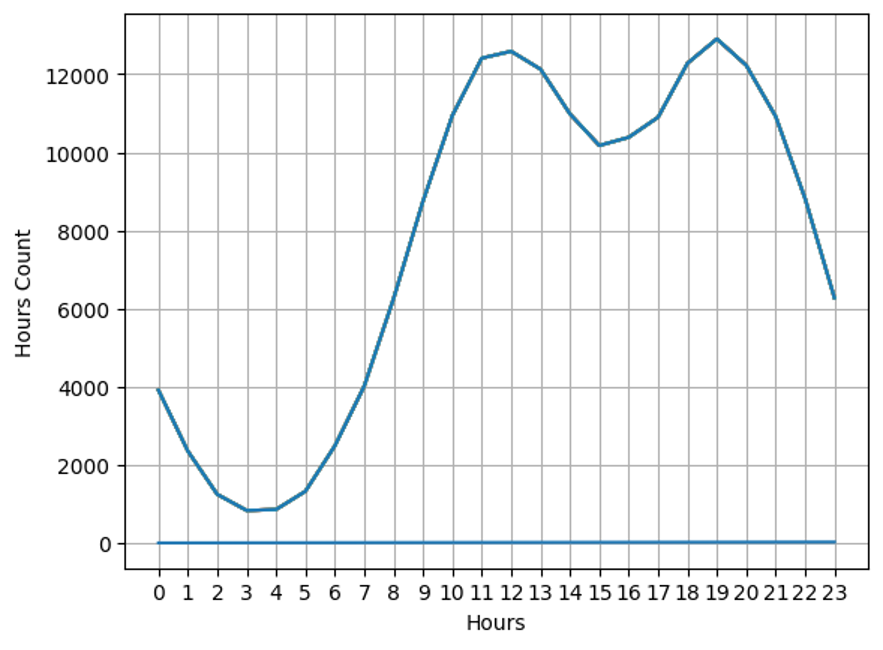
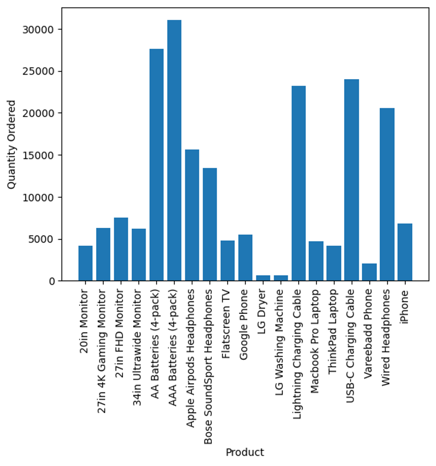

# Business sales analysis

## Introduction
---
An analysis was done on the sales data of a store to answer some business questions that could help the business scale up its sales. 
**Disclaimer: This was a guarded project from Keith Galli, and the data was also gotten from him.

## Skills demonstrated
- Usage of the pandas library for data cleaning and analysis
- Usage of matplotlib library for data visualizations
- Python functions 

## Problem statement
1. What was the best month for sales? And what is the possible reason.
2. What city has the highest number of sales.
3. What time should advertisements be posted to maximize purchases by customers?
4. What products are most purchased together.
5. What items are sold the most and what is the possible reason for them being sold the most.

## Analysis
1. December was the month with the highest sales and the possible reason for that can be the fact that it is a festive and holiday period and people would probably be buying items for gifts and other purposes.

***

2. San Francisco CA was the city with the most sales

***

3. The number of orders peaked around 11 am, 12 am, and 7 pm. 

***
4. The most ordered and purchased products were iPhones and lightning cables, which makes sense as they both go together.  
***

5. AAA and AA Batteries were the most ordered items, which could probably be related to the price.

***

## Recommendations and conclusions:
Posting advertisements around 11 am, 12 am, and 7 pm can be recommended to maximize sales as people would most likely be on their devices during these periods.

